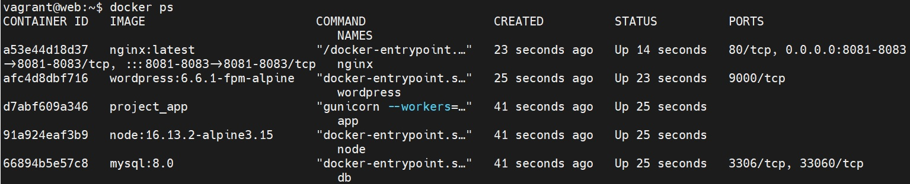
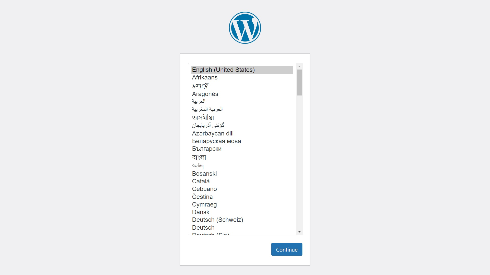
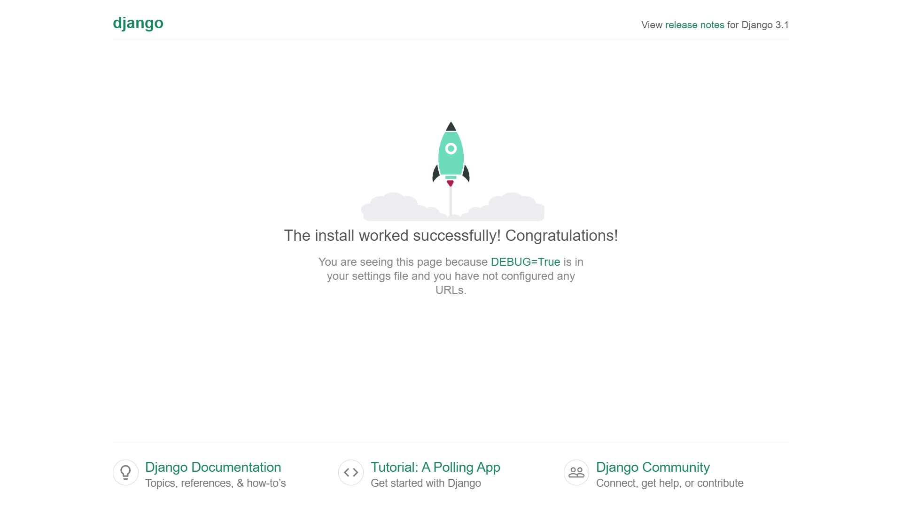

# Otus Homework 26. Web.
### Цель домашнего задания
Получить практические навыки в настройке инфраструктуры с помощью манифестов и конфигураций;
Отточить навыки использования ansible/vagrant/docker.
### Описание домашнего задания

Варианты стенда:
- nginx + php-fpm (laravel/wordpress) + python (flask/django) + js(react/angular);
- nginx + java (tomcat/jetty/netty) + go + ruby;
- можно свои комбинации.

Реализации на выбор:
- на хостовой системе через конфиги в /etc;
- деплой через docker-compose.
## Выполнение
Задание выполняется с помощью **Docker**. Установка:
```bash
sudo apt update
sudo apt install ca-certificates curl
sudo curl -fsSL https://download.docker.com/linux/ubuntu/gpg -o /etc/apt/keyrings/docker.asc
sudo chmod a+r /etc/apt/keyrings/docker.asc

echo \
  "deb [arch=$(dpkg --print-architecture) signed-by=/etc/apt/keyrings/docker.asc] https://download.docker.com/linux/ubuntu \
  $(. /etc/os-release && echo "$VERSION_CODENAME") stable" | \
  sudo tee /etc/apt/sources.list.d/docker.list > /dev/null
sudo apt update
```
Необходимо развернуть 5 docker контейнеров:
|Название|Образ|Порты|Вольюмы|Зависимость|
|-|-|-|-|-|
|nginx|nginx:latest|8081:8081, 8082:8082, 8083:8083|nginx:/etc/nginx/conf.d, wordpress:/var/www/html|worpdress, node, app|
|db|mysql:8.0||dbdata:/var/lib/mysql||
|wordpress|wordpress:6.6.1-fpm-alpine||wordpress:/var/www/html|db|
|node|node:16.13.2-alpine3.15||node:/opt/server||
|app|Собираем свой образ из python:3.8.3|||

Будем использовать Docker-compose: 
#### Docker-compose.yml
```bash
services:
  db:
    image: mysql:8.0
    container_name: db
    restart: unless-stopped
    volumes:
      - ./dbdata:/var/lib/mysql
    env_file: db.env
    networks:
      - app-network

  wordpress:
    image: wordpress:6.6.1-fpm-alpine
    container_name: wordpress
    depends_on:
    - db
    restart: unless-stopped
    env_file: wp.env
    volumes:
      - ./wordpress:/var/www/html
    networks:
      - app-network

  nginx:
    image: nginx:latest
    container_name: nginx
    depends_on:
      - wordpress
      - node
      - app
    restart: unless-stopped
    ports:
      - "8081:8081"
      - "8082:8082"
      - "8083:8083"
    volumes:
      - ./wordpress:/var/www/html
      - ./nginx:/etc/nginx/conf.d
    networks:
      - app-network

  node:
    image: node:16.13.2-alpine3.15
    container_name: node
    working_dir: /opt/server
    volumes:
      - ./node:/opt/server
    command: node test.js
    networks:
      - app-network

  app:
    build: ./python
    container_name: app
    restart: unless-stopped
    env_file: app.env
    command: "gunicorn --workers=2 --bind=0.0.0.0:8000 mysite.wsgi:application"
    networks:
      - app-network

networks:
  app-network:
    driver: bridge
```
### Конфигурационные файлы nginx
#### wordpress.conf
```bash
server {

    listen 8081;
    server_name _;

    root /var/www/html;
    index index.php;

    location / {
        try_files $uri $uri/ /index.php$is_args$args;
    }

    location ~ \.php$ {
        try_files $uri =404;
        fastcgi_split_path_info ^(.+\.php)(/.+)$;
        fastcgi_pass wordpress:9000;
        fastcgi_index index.php;
        include fastcgi_params;
        fastcgi_param SCRIPT_FILENAME $document_root$fastcgi_script_name;
        fastcgi_param PATH_INFO $fastcgi_path_info;
    }

}
```
#### node.conf
```bash
server {

    listen 8082;
    server_name _;

    location / {
      proxy_pass http://node:3000;
      proxy_http_version 1.1;
      proxy_set_header Upgrade $http_upgrade;
      proxy_set_header Connection "upgrade";
      proxy_redirect off;
      proxy_set_header Host $host;
      proxy_set_header X-Real-IP $remote_addr;
      proxy_set_header X-Forwarded-For $proxy_add_x_forwarded_for;
      proxy_set_header X-Forwarded-Host $server_name;
    }
}
```
#### app.conf
```bash
server {

    listen 8083;

    location / {
      try_files $uri @proxy_to_app;
    }

    location @proxy_to_app {
      proxy_pass http://app:8000;
      proxy_http_version 1.1;
      proxy_set_header Upgrade $http_upgrade;
      proxy_set_header Connection "upgrade";
      proxy_redirect off;
      proxy_set_header Host $host;
      proxy_set_header X-Real-IP $remote_addr;
      proxy_set_header X-Forwarded-For $proxy_add_x_forwarded_for;
      proxy_set_header X-Forwarded-Host $server_name;
    }
}
```

Запустим контейнеры:
```bash
docker compose up -d
```
Результатом выполнения команды будут 5 запущенных контейнеров.  
  
  
  
Nginx выполняет роль frontend сервера и проксирует запросы на приложения. В итоге на порту 8081 будет доступен wordpress,  
  
  
на 8082 node.js приложение 
  
и на 8083 django.
  

### Ansible
Для выполнения задания с помощью **ansible** запустим playbook:
```bash
ansible-playbook web.yml
```
